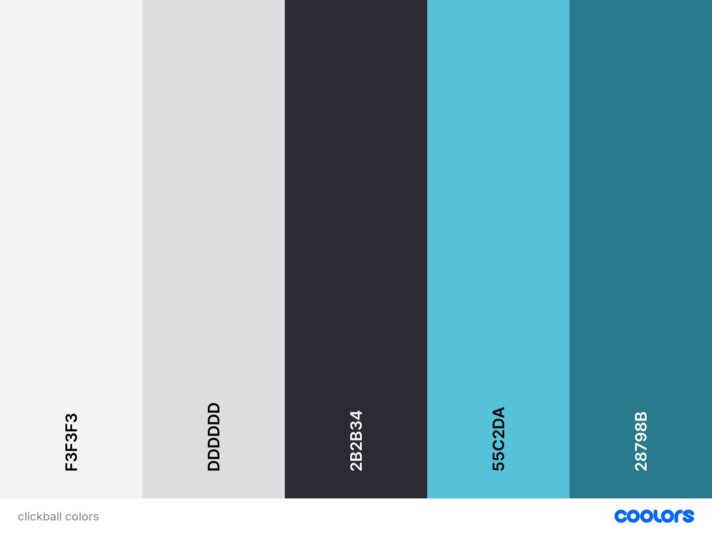

# [TABLETENNIS VS PINGPONG](https://benschaf.github.io/tabletennis-vs-pingpong)

Have you ever finally wanted to settle the difference in meaning of “Table Tennis” and “Ping Pong”? Have you never heard of the sport “Clickball” before? Then this website is perfect for you!

This repository provides an engaging and informative platform that explores the history, differences, and fun facts about the terms Ping Pong, Table Tennis and Clickball. It includes five sections, covering the general differences of Ping Pong and Table Tennis, a visual representation of the key events and milestones in the history of Ping Pong and Table Tennis, an interesting collection of quotes on the topic, a subscription-based service that provides users with regular updates and insights about the world of Ping Pong and Table Tennis (Disclaimer: The subscription feature is still in development) and a media gallery.

## UX
The design process was separated into XXXX phases:
1. **Collecting inspiration:** Design ideas for the project were taken from the following two websites: store.google.com and youtube.com. The resulting design for this website is kept clean and simple.
2. **Creating User Stories, Wireframes and Mockups:** These were prepared in order to create a better vision of the final project. These drafts were then tailored to provide a relevant and meaningufl exprecience to the user.
3. **Collecting feedback early on:** My Mentor and the great Community of Code Institute were essential in ironing out UX considerations that I hadn't considered. For Acknowledgements see ["Acknowledgements"](###Acknowledgements).

UX research practices werent in the scope of this project.

### Colour Scheme
The Colour Scheme for this Project was extracted from it's [hero image](#tabletennis-vs-pingpong). The blue tones work nicely together with most Table Tennis related Pictures because of the blue color of official Table Tennis tables.

- `#2B2B34` used for darker backgrounds.
- `#F3F3F3` used for text bubbles
- `#151536` used for the footer.
- `#000000` used for primary text.
- `#55C2DA` used for primary highlights.

I used [coolors.co](https://coolors.co/2b2b34-f3f3f3-151526-000000-55c2da) to generate my colour palette.

### Typography
- [Montserrat](https://fonts.google.com/specimen/Montserrat) was used for all text on the website. `letter-spacing -2px` was used on titles to differentiate them from other text.
- [Font Awesome](https://fontawesome.com/) icons were used throughout the site, such as the social media icons in the footer.

## User Stories

-- can I include user stories that go beyond the scope of the project? --

|As a|I would like to|so that I can|
|----|----|----|
|new site user|find information about Table Tennis,|tell my friends about it.|
|Returning user|Access the latest news and trends in the world of Table Tennis,|Stay informed about the sport.|
|Table Tennis enthusiast|Find training resources and tips,|Improve my skills and technique.|
|Table Tennis enthusiast|Find information about the rules and regulations of Table Tennis,|Improve my understanding of the sport.|
|Ping Pong player|Learn more about the differences between Ping Pong and Table Tennis,|Improve my knowledge of the sport.|
|Table Tennis player|Access a media gallery with photos and videos of Table Tennis matches,|Enjoy watching Table Tennis matches and highlights.|
|Table Tennis player|Access a forum where I can connect with other Table Tennis players,|Share tips and advice with other players.|
|Table Tennis fan|Find merchandise related to Table Tennis,|Show my support for the sport.|

## Wireframes

### Mobile Wireframes

 Click here to see the Mobile Wireframes 

Hero

Differences

Timeline

Quotes

Sign-up

Footer

### Tablet Wireframes

 Click here to see the Tablet Wireframes 

Hero

Differences

Timeline

Quotes

Sign-up

Footer

### Desktop Wireframes

 Click here to see the Desktop Wireframes 

Hero

Differences

Timeline

Quotes

Sign-up

Footer

## Features

### Existing Features

### Future Features

## Tools & Technologies Used

- [HTML](https://en.wikipedia.org/wiki/HTML) used for the main site content.
- [CSS](https://en.wikipedia.org/wiki/CSS) used for the main site design and layout.
- [CSS Flexbox](https://www.w3schools.com/css/css3_flexbox.asp) used for an enhanced responsive layout.
- [Git](https://git-scm.com/) used for version control. (`git add`, `git commit`, `git push`)
- [GitHub](https://github.com/) used for secure online code storage.
- [GitHub Pages](https://pages.github.com/) used for hosting the deployed front-end site.
- [Gitpod](https://gitpod.io/) used as a cloud-based IDE for development.
- [Codeanywhere](https://codeanywhere.com/) used as a cloud-based IDE for development.
- [Visual Studio Code](https://visualstudio.microsoft.com/de/#vscode-section) used a  local IDE for development.
- [draw.io](https://www.drawio.com/) used for wireframe creation.
- [Figma](https://figma.com) used for design creation.

## Testing

## Deployment
The site was deployed to GitHub Pages. The steps to deploy are as follows:

- In the [GitHub repository](https://github.com/benschaf/tabletennis-vs-pingpong), navigate to the Settings tab
- From the source section drop-down menu, select the **Main** Branch, then click "Save".
- The page will be automatically refreshed with a detailed ribbon display to indicate the successful deployment.

The live link can be found [here](https://benschaf.github.io/tabletennis-vs-pingpong)

### Local Deployment
This project can be cloned or forked in order to make a local copy on your own system.

### Cloning
You can clone the repository by following these steps:

1. Go to the [GitHub repository](https://github.com/benschaf/tabletennis-vs-pingpong)
2. Locate the Code button above the list of files and click it
3. Select if you prefer to clone using HTTPS, SSH, or GitHub CLI and click the copy button to copy the URL to your clipboard
4. Open Git Bash or Terminal
5. Change the current working directory to the one where you want the cloned directory
6. In your IDE Terminal, type the following command to clone my repository:
	- `git clone https://github.com/benschaf/tabletennis-vs-pingpong.git`
7. Press Enter to create your local clone.

Alternatively, if using Gitpod, you can click below to create your own workspace using this repository.

Please note that in order to directly open the project in Gitpod, you need to have the browser extension installed.
A tutorial on how to do that can be found [here](https://www.gitpod.io/docs/configure/user-settings/browser-extension).

### Forking
By forking the GitHub Repository, we make a copy of the original repository on our GitHub account to view and/or make changes without affecting the original owner's repository.
You can fork this repository by using the following steps:

1. Log in to GitHub and locate the [GitHub Repository](https://github.com/benschaf/tabletennis-vs-pingpong)
2. At the top of the Repository (not top of page) just above the "Settings" Button on the menu, locate the "Fork" Button.
3. Once clicked, you should now have a copy of the original repository in your own GitHub account!

### Local vs Deployment

## Credits

### Content

### Media

### Acknowledgements
- I would like to thank my Code Institute mentor, [Tim Nelson](https://github.com/TravelTimN) for their support throughout the development of this project.
- I would like to thank the [Code Institute](https://codeinstitute.net/) tutor team for their assistance with troubleshooting and debugging some project issues.
- I would like to thank the [Code Institute Slack community](https://code-institute-room.slack.com/) for the moral support; it kept me going during periods of self doubt and imposter syndrome.
- I would like to thank my wife Maria, for believing in me, and allowing me to make this transition into software development.