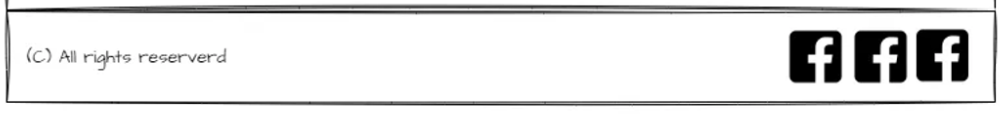

# [TABLETENNIS VS PINGPONG](https://benschaf.github.io/tabletennis-vs-pingpong)

Do you finally want to settle the difference between “Table Tennis” and “Ping Pong”? Have you never heard of the sport “Clickball” before? Then this website is perfect for you!


This repository provides an engaging and informative platform that explores the history, differences, and fun facts about the terms Ping Pong, Table Tennis and Clickball. It includes five sections, covering the general differences of Ping Pong and Table Tennis, a visual representation of the key events and milestones in the history of Ping Pong and Table Tennis, an interesting collection of quotes on the topic, a subscription-based service that provides users with regular updates and insights about the world of Ping Pong and Table Tennis (Disclaimer: The subscription feature is still in development) and a media gallery.

## UX
The UX planning process was separated into three phases:
1. **Collecting inspiration:** Design ideas for the project were taken from the following two websites: store.google.com and youtube.com. The resulting design for this website is kept clean and simple.
2. **Creating User Stories, Wireframes and Mockups:** These were prepared in order to create a better vision of the final project. These drafts were then tailored to provide a relevant and meaningufl exprecience to the user.
3. **Collecting feedback early on:** My Mentor and the great Community of Code Institute were essential in ironing out UX considerations that I hadn't considered.

UX research practices werent in the scope of this project.

### Colour Scheme
The Colour Scheme for this Project was extracted from it's [hero image](#tabletennis-vs-pingpong). The blue tones work nicely together with most Table Tennis related Pictures because of the blue color of official Table Tennis tables.

- `#FFFFFF` used for white background
- `#F3F3F3` used for light background
- `#DDDDDD` used for secondary light background
- `#2B2B34` used for dark background
- `#55C2DA` used for primary highlights
- `#28798B` used for secondary hightlights
- `#000000` used for primary text
- `#FFFFFF` used for secondary text

I used [coolors.co](https://coolors.co/2b2b34-f3f3f3-151526-000000-55c2da) to generate my colour palette.


I've used CSS `:root` variables to easily update the global colour scheme by changing only one value, instead of everywhere in the CSS file.

```css
    :root {
        /* p = Primary / s = Secondary */
        --white-backgorund: #fff;
        --light-background: #F3F3F3;
        --s-light-background: #ddd;
        --dark-backgrond: #2B2B34;
        --p-highlight: #55C2DA;
        --s-highlight: #28798B;
        --p-text: #000;
        --s-text: #fff;
    }
```

### Typography
- [Montserrat](https://fonts.google.com/specimen/Montserrat) was used for all text on the website. `letter-spacing -2px` was used on titles to differentiate them from other text.
- [Font Awesome](https://fontawesome.com/) icons were used throughout the site, such as the social media icons in the footer.

## User Stories

|As a|I would like to|so that I can|
|----|----|----|
|new site user|find information about Table Tennis,|tell my friends about it.|
|Returning user|Access the latest news and trends in the world of Table Tennis,|Stay informed about the sport.|
|Ping Pong player|Learn more about the differences between Ping Pong and Table Tennis,|Improve my knowledge of the sport.|
|Table Tennis player|Access a media gallery with photos and videos of Table Tennis matches,|Enjoy watching Table Tennis matches and highlights.|

*Note: User stories that aren't in the scope of this version can be found under Future Features.*

## Wireframes
Wireframes were created using draw.io. Aditionally I created mockups of the website using [Figma](https://www.figma.com/file/OFxJJWxgwTg3WBurLY3zGF/Ping-Pong-Wireframe?type=design&node-id=0%3A1&mode=design&t=plcfjeSpSSZlJuFL-1) which helped immensly with translating the design ideas to responsive CSS code.

*Note that the Figma mockups don't look exactly like the final product since I only used them for initial implementation of the code. They represent an earlier version of the site. For later design changes I adapted the wireframes made with draw.io above.*

[Click here](https://www.figma.com/file/OFxJJWxgwTg3WBurLY3zGF/Ping-Pong-Wireframe?type=design&node-id=0%3A1&mode=design&t=plcfjeSpSSZlJuFL-1) to view the Figma project.

### Mobile Wireframes and Mockups
<details>
<summary> Click here to see the Mobile Wireframes </summary>

| Section | Wireframe (draw.io) | Mockup (Figma) |
|-|-|-|
| Hero |  |  |
| Differences |  |  |
| Timeline |  |  |
| Quotes |  |  |
| Sign-up |  |  |
| Footer |  |  |

</details>

### Tablet Wireframes and Mockups
<details>
<summary> Click here to see the Tablet Wireframes </summary>

| Section | Wireframe (draw.io) | Mockup (Figma) |
|-|-|-|
| Hero |  |  |
| Differences |  |  |
| Timeline |  |  |
| Quotes |  |  |
| Sign-up |  |  |
| Footer |  |  |

</details>

### Desktop Wireframes and Mockups
<details>
<summary> Click here to see the Desktop Wireframes </summary>

| Section | Wireframe (draw.io) | Mockup (Figma) |
|-|-|-|
| Hero |  |  |
| Differences |  |  |
| Timeline |  |  |
| Quotes |  |  |
| Sign-up |  |  |
| Footer |  |  |

</details>

## Features

### Existing Features

#### [Header with Logo and Navigation 🔗](https://github.com/benschaf/tabletennis-vs-pingpong/blob/6a418b11362ddfb6daa11785b437b07b81038081/index.html#L24-L43)
The website has a header navigation bar that allows users to easily navigate to different sections of the site. The last item of the navigation bar serves as a cta (call to action) for the user to subscribe to the [newsletter](#signup-section).


#### [Landing Page 🔗](https://github.com/benschaf/tabletennis-vs-pingpong/blob/6a418b11362ddfb6daa11785b437b07b81038081/index.html)
The Landing page `index.html` gives the user an extensive overview over the topic. It starts with a hero section and a call to action at the top. After that the user discovers information in bite sized sections by scrolling further down. All sections of the Landing page are presented below.


#### [Hero Section 🔗](https://github.com/benschaf/tabletennis-vs-pingpong/blob/6a418b11362ddfb6daa11785b437b07b81038081/index.html#L47-L62)
The website has a hero section with an image and text that introduces the site and its purpose.
The hero section also includes a visible call to action button which links to the [Signup Section](#signup-section).


#### [Differences Section 🔗](https://github.com/benschaf/tabletennis-vs-pingpong/blob/6a418b11362ddfb6daa11785b437b07b81038081/index.html#L63-L102)
The Differences section lays out initial information about the differences between Table Tennis and Ping Pong. It also describes what the term 'Clickball' means.
This section is accompanied by an image to generate some interest in this part of the page.


#### [Timeline Section 🔗](https://github.com/benschaf/tabletennis-vs-pingpong/blob/6a418b11362ddfb6daa11785b437b07b81038081/index.html#L103-L201)
The website has a timeline section that displays important events in a chronological order. The timeline is designed in a visually interesting and intuitive way by displaying a vertical timeline next to visually separated events.


#### [Quotes Section 🔗](https://github.com/benschaf/tabletennis-vs-pingpong/blob/6a418b11362ddfb6daa11785b437b07b81038081/index.html#L202-L248)
The website has a quotes section that displays quotes from users. The quotes are only static at this stage of development which means that they are directly coded into the `index.html` file.


#### [Signup Section 🔗](https://github.com/benschaf/tabletennis-vs-pingpong/blob/6a418b11362ddfb6daa11785b437b07b81038081/index.html#L249-L267)
The website has a signup form that allows users to subscribe to a newsletter or other updates. The only function of the signup form at this stage is that it links to the `subscribed.html` page. The email entered into the form isn't stored anywhere.
This also means that the user won't receive any newsletter updates via email contrary to what is suggested on the website.

The limited functionality of the signup form is implemented as follows:

``` html
    <form id="signup-form" action="subscribed.html">
        <input type="email" id="email" name="email" placeholder="your@email.here" required>
        <input type="submit" value="Sign up now">
    </form>
```
[click to view code in project](https://github.com/benschaf/tabletennis-vs-pingpong/blob/37f5afb3688ce1d25377fb5852d1a6e8771feda2/index.html#L261-L264)

The `method` attribute of the `form` tag was omitted. This basically turns the submit button into an anchor to the `action` attribute content - in this case a link to `subscribed.html`


#### [Signup Successful Section 🔗](https://github.com/benschaf/tabletennis-vs-pingpong/blob/6a418b11362ddfb6daa11785b437b07b81038081/subscribed.html)
Once the user inserts an email and submits the form, they are redirected to the `subscribed.html` page. There they receive a quick message that they have successfully subscribed. After 10 seconds the website redirects the user automatically back to the Signup Section.

The automatic redirect is acheived using the following code on line 21 in `subscribed.html`:

`<meta http-equiv="refresh" content="10; url=index.html#signup-section">`
[click to view code in project](https://github.com/benschaf/tabletennis-vs-pingpong/blob/37f5afb3688ce1d25377fb5852d1a6e8771feda2/subscribed.html#L21)


#### [Gallery Page 🔗](https://github.com/benschaf/tabletennis-vs-pingpong/blob/6a418b11362ddfb6daa11785b437b07b81038081/gallery.html)
The Gallery Page displays a couple of pictures on the topic of Table Tennis vs. Ping Pong. The user can spend some time here gathering impressions.
The Gallery was styled using a responsive vertical masonry style pattern. The code for the gallery is heavily adapted from [w3bits.com](https://w3bits.com/flexbox-masonry/).

The vertical masonry is acheived using flexbox.
``` css
    .masonry-gallery {
        flex-wrap: wrap;
        max-height: 2190px;
        /* Adjustment for the gutter */
        margin-left: -8px;
    }

    .masonry-brick {
        /* Some gutter */
        margin: 0 8px 8px 0;
        /* allow for 2 columns */
        width: 50%;
    }

    .masonry-brick>img {
        width: 100%;
        object-fit: cover;
        border-radius: 12px;
    }
```
[click to view code in project](https://github.com/benschaf/tabletennis-vs-pingpong/blob/b4edba236cd7baf267776659b745b39e87cc2814/assets/css/style.css#L671-L689)


#### [Footer 🔗](https://github.com/benschaf/tabletennis-vs-pingpong/blob/6a418b11362ddfb6daa11785b437b07b81038081/index.html#L269-L295)
The website has a footer that includes social media links and other relevant information.


#### Responsive Design
The website is designed to be responsive and can adapt to different screen sizes, making it easy to use on mobile devices.

##### Pop-up menu and signup form on mobile
The navigation menu and the signup form are not visible at first on smaller screens. They pop-up, after clicking on a corresponding button. This functionality is achieved using only css. The visibility of the popup changes from `display: none;` to `display: box` and `display: flex;` respectively. This code was adapted from the [love running project by code institute](https://github.com/Code-Institute-Solutions/love-running-v3/tree/main/3.5b-toggling-a-dropdown-menu). Below is the html and css for the signup form popup functionality:

``` html
    <input type="checkbox" id="signup-toggle" name="signup-toggle">
    <label for="signup-toggle" aria-label="Open Signup input Field">
        <span class="hero-button newsletter-button">Get our Newsletter</span>
    </label>
    <form id="signup-form" action="subscribed.html"> 
        <!-- Form content --> 
    </form>
```
[click to view code in project](https://github.com/benschaf/tabletennis-vs-pingpong/blob/f58acad437c0de227ef2afa16788f7ac63c33537/index.html#L256-L264)
``` css
    /* Signup toggle */
    #signup-toggle:checked~#signup-form {
        display: flex;
    }

    #signup-toggle {
        display: none;
    }
```
[click to view code in project](https://github.com/benschaf/tabletennis-vs-pingpong/blob/f58acad437c0de227ef2afa16788f7ac63c33537/assets/css/style.css#L410-L417)


##### Animated Quotes Section on mobile
To reduce scrolling and to make the website a bit more interesting the quotes section is animated when viewed on mobile screens. By clicking on one of the buttons below the quote, a corresponding quote slides into view.

The code for this feature is adapted from a project on codepen.io by [maheshambure21](https://codepen.io/maheshambure21/pen/qZZrxy?editors=1100).

The functionality is acheived using radio buttons and an animation:
``` css
    .slider__nav:checked {
        animation: check 0.4s linear forwards;
    }

    /* different position depending on which radio button is checked */
    .slider__nav:checked:nth-of-type(1)~.slider__inner {
        left: 0%;
    }

    .slider__nav:checked:nth-of-type(2)~.slider__inner {
        left: -100%;
    }

    .slider__nav:checked:nth-of-type(3)~.slider__inner {
        left: -200%;
    }

    .slider__nav:checked:nth-of-type(4)~.slider__inner {
        left: -300%;
    }

    .slider__inner {
        /* other code */
        transition: left 0.4s;
    }

    /* animation for feedback when checking radio buttons */
    @keyframes check {
        50% {
            outline-color: #6a6a80;
            box-shadow: 0 0 0 12px #6a6a80, 0 0 0 36px rgba(51, 51, 51, 0.2);
        }

        100% {
            outline-color: #6a6a80;
            box-shadow: 0 0 0 0 #6a6a80, 0 0 0 0 rgba(51, 51, 51, 0);
        }
    }
```
[click to view code in project](https://github.com/benschaf/tabletennis-vs-pingpong/blob/f58acad437c0de227ef2afa16788f7ac63c33537/assets/css/style.css#L492-L555)


##### Max Width and Background Colour
The website restricts the width of the main section to 1600px for readability and centers it if it gets too large.
The website has a background color of `#f3f3f3`.


### Future Features

## Future User stories

|As a|I would like to|so that I can|
|----|----|----|
|Table Tennis enthusiast|Find training resources and tips,|Improve my skills and technique.|
|Table Tennis enthusiast|Find information about the rules and regulations of Table Tennis,|Improve my understanding of the sport.|
|Table Tennis player|Access a forum where I can connect with other Table Tennis players,|Share tips and advice with other players.|
|Table Tennis fan|Find merchandise related to Table Tennis,|Show my support for the sport.|

## Future Feature suggestions

- **Improved Subscription Feature**: I think it would be great to add more functionality to the subscription feature. For example, I could allow users to choose the frequency of updates they receive or provide exclusive content to subscribers.

- **Social Media Integration**: I already have social media links in my footer. I could add more social media integration to my website, such as allowing users to share content from my website directly to their social media accounts.

- **Training Videos**: I could add a section to my website that includes training videos created by professional Table Tennis players. This would be a great resource for Table Tennis enthusiasts who want to improve their skills and technique.

- **Discussion Forum**: I would like to add a discussion forum to my website that allows users to create posts, reply to posts, and interact with other users. This would be a great way for Table Tennis players to connect with each other and share tips and advice.

- **Live Streaming**: I think it would be great to add a live streaming feature that allows users to watch Table Tennis and Ping Pong matches in real-time. This feature could also include a chat function that allows users to interact with each other while watching the matches.

## Tools & Technologies Used

- [HTML](https://en.wikipedia.org/wiki/HTML) used for the main site content
- [CSS](https://en.wikipedia.org/wiki/CSS) used for the main site design and layout
- [CSS Flexbox](https://www.w3schools.com/css/css3_flexbox.asp) used for an enhanced responsive layout
- [Git](https://git-scm.com/) used for version control (`git add`, `git commit`, `git push`)
- [GitHub](https://github.com/) used for secure online code storage
- [GitHub Pages](https://pages.github.com/) used for hosting the deployed front-end site
- [Gitpod](https://gitpod.io/) used as a cloud-based IDE for development
- [Codeanywhere](https://codeanywhere.com/) used as a cloud-based IDE for development
- [Visual Studio Code](https://visualstudio.microsoft.com/de/#vscode-section) used a  local IDE for development
- [draw.io](https://www.drawio.com/) used for wireframe creation
- [Figma](https://figma.com) used for design creation
- [coolors.co](https://coolors.co/2b2b34-f3f3f3-151526-000000-55c2da) used to create colour palette
- [tinypng](https://tinypng.com/) used to compress images
- [Birme](https://www.birme.net/?no_resize=true&image_format=webp&quality_webp=80) used to convert images to .webp format
- [Windows Snipping Tool](https://support.microsoft.com/de-de/windows/aufnehmen-von-screenshots-mithilfe-des-snipping-tools-00246869-1843-655f-f220-97299b865f6b) used to take screenshots and screencasts on Windows
- [Adobe free mp4 to gif converter](https://www.adobe.com/express/feature/video/convert/mp4-to-gif) used to convert screencasts to gif
- [autoprefixer](https://autoprefixer.github.io/) used to add vendor prefixes to css for browser compatibility
- [Notion](https://www.notion.so/) used to create Kanban Board for issue tracking
- [Github Issues](https://github.com/benschaf/tabletennis-vs-pingpong/issues) used for issue tracking (replaced Notion during the project)

## Testing
Code Validation and Testing can be found in a separate file called [TESTING.md](TESTING.md)

## Deployment
The site was deployed to GitHub Pages. The steps to deploy are as follows:

- In the [GitHub repository](https://github.com/benschaf/tabletennis-vs-pingpong), navigate to the Settings tab
- From the source section drop-down menu, select the **Main** Branch, then click "Save".
- The page will be automatically refreshed with a detailed ribbon display to indicate the successful deployment.

The live link can be found [here](https://benschaf.github.io/tabletennis-vs-pingpong)

### Local Deployment
This project can be cloned or forked in order to make a local copy on your own system.

### Cloning
You can clone the repository by following these steps:

1. Go to the [GitHub repository](https://github.com/benschaf/tabletennis-vs-pingpong)
2. Locate the Code button above the list of files and click it
3. Select if you prefer to clone using HTTPS, SSH, or GitHub CLI and click the copy button to copy the URL to your clipboard
4. Open Git Bash or Terminal
5. Change the current working directory to the one where you want the cloned directory
6. In your IDE Terminal, type the following command to clone my repository:
	- `git clone https://github.com/benschaf/tabletennis-vs-pingpong.git`
7. Press Enter to create your local clone.

Alternatively, if using Gitpod, you can click below to create your own workspace using this repository.

[](https://gitpod.io/#https://github.com/benschaf/tabletennis-vs-pingpong)

Please note that in order to directly open the project in Gitpod, you need to have the browser extension installed.
A tutorial on how to do that can be found [here](https://www.gitpod.io/docs/configure/user-settings/browser-extension).

### Forking
By forking the GitHub Repository, we make a copy of the original repository on our GitHub account to view and/or make changes without affecting the original owner's repository.
You can fork this repository by using the following steps:

1. Log in to GitHub and locate the [GitHub Repository](https://github.com/benschaf/tabletennis-vs-pingpong)
2. At the top of the Repository (not top of page) just above the "Settings" Button on the menu, locate the "Fork" Button.
3. Once clicked, you should now have a copy of the original repository in your own GitHub account!

### Local vs Deployment
Note that the Site behaves slightly differently when vieving offline from a cloned repository since icons and fonts are imported from online libraries.

## Credits

### Content
| Source | Location | Notes |
| --- | --- | --- |
| [Markdown Builder](https://tim.2bn.dev/markdown-builder) | README and TESTING | tool to help generate the Markdown files |
| [Chris Beams](https://chris.beams.io/posts/git-commit) | version control | "How to Write a Git Commit Message" |
|[Code Institute](https://github.com/Code-Institute-Org/love-running-2.0)| head |How to write meta tags for search engines|
|[Code Institute](https://github.com/Code-Institute-Org/love-running-2.0)| navigation bar and signup-section |Navigation bar and Newsletter form that toggle in and out of view|
|[Code Institute](https://github.com/Code-Institute-Org/love-running-2.0)| footer |Display links to socials in footer using Fontawesome and Flexbox|
|[Code Institute](https://github.com/Code-Institute-Org/love-running-2.0)| whole site | how to use the `*` selector in CSS to override default browser styles |
|[Favicon Generator](https://www.favicon-generator.org)| Favicon |turn Fontawesome icon into favicon files|
|[MDN Web Docs](https://developer.mozilla.org/en-US/docs/Web/HTML/Element/meta/name/theme-color)| theme-color meta tag|change the theme color on phone browsers|
|[MDN Web Docs](https://developer.mozilla.org/en-US/docs/Web/HTML/Element/blockquote)| quotes-section |semantic and accessible HTML for quotations including a way to cite|
|[codepen.io](https://codepen.io/maheshambure21/pen/qZZrxy?editors=1100)| quotes-section |interactive quote slider section|
|[Amp What](https://www.amp-what.com/unicode/search/%26copy%3B)| footer |&copy; / `&copy;` character|
| [Tim Nelson](https://github.com/TravelTimN) and  [W3C](https://www.w3.org/TR/WCAG20-TECHS/H76.html) | subscribed page | how to automatically redirect to a different page after a period of time |
|[Stack Overflow](https://stackoverflow.com/questions/8821193/nth-child-or-first-child-how-to-select-first-and-second-child-in-one)| navigation bar | How to select only first and second child |
|[w3bits.com](https://w3bits.com/flexbox-masonry/) | gallery page | how to code a vertical masonry style gallery |
|[MDN Web Docs](https://developer.mozilla.org/en-US/docs/Web/CSS/scroll-behavior) | main site | how to scroll smoothly to a section by clicking a link |
|[CSS-Tricks](https://css-tricks.com/snippets/css/a-guide-to-flexbox/) | main site | code responsive designs using flexbox (thanks go to Code Institute for mentioning this awesome source) |
| [W3schools](https://www.w3schools.com/css/css_align.asp) | main site | how to center a div |
| [Love Running by Code Institute](https://github.com/Code-Institute-Org/love-running-2.0) | background pictures | how to position background pictures in a div using `background: url([img-url])no-repeat center center/cover` shorthand |
| [W3schools](https://www.w3schools.com/css/css_form.asp) | input form | how to address form inputs in CSS |
| [W3schools](https://www.w3schools.com/css/css_rwd_mediaqueries.asp) | main site | how to add different kinds of media queries i.e. `min-width` and `max-width` properties|
| [codepen.io](https://codepen.io/maheshambure21/pen/qZZrxy?editors=1100) | quotes section (only on mobile size) | how to do the functionality of the slider-quotes section |
| [CSS :root variables](https://www.w3schools.com/css/css3_variables.asp) | whole site | how to use reusable styles throughout the site |

### Media
| Source | Location | filename | Notes |
| --- | --- | --- | --- |
| [Fontawesome](https://fontawesome.com) | [product page](https://fontawesome.com/icons/table-tennis-paddle-ball?f=classic&s=solid) | favicon-32x32.png & favicon.ico | Source for the Favicon before turning into .png and .ico file |
|[Fontawesome](https://fontawesome.com) | whole site | various icons | icons used: fa-bars fa-circle-check fa-turn-down fa-trademark fa-flag-checkered fa-children fa-volume-high fa-facebook fa-twitter-square fa-youtube-square fa-instagram |
| [Unsplash](https://unsplash.com) | [product page](https://unsplash.com/de/fotos/selektiver-fokus-der-blauen-tischtennisplatte-c9aGBqkeoE4) | gallery-img-0.webp | thanks go to Ivan Cortez |
| [Unsplash](https://unsplash.com) | [product page](https://unsplash.com/de/fotos/mann-spielt-tischtennis-Rf6z7CFDz48) | gallery-img-1.webp | thanks go to Kenny Eliason |
| [Unsplash](https://unsplash.com) | [product page](https://unsplash.com/de/fotos/rot-brauner-tischtennisschlager-aus-holz-i0kB5B9J8Ds) | gallery-img-2.webp | thanks go to Lisa Keffer |
| [Unsplash](https://unsplash.com) | [product page](https://unsplash.com/de/fotos/mann-im-roten-rundhals-t-shirt-tagsuber-neben-blauem-tisch-yLfHp27Clcg) | gallery-img-3.webp | thanks go to Melanie Lim |
| [Unsplash](https://unsplash.com) | [product page](https://unsplash.com/de/fotos/tischtennisball-in-der-nahe-von-schlagern-auf-dem-tisch-hdHMZumzLTo) | gallery-img-4.webp | thanks go to Nils Schirmer |
| [Unsplash](https://unsplash.com) | [product page](https://unsplash.com/de/fotos/mann-in-grau-schwarzem-kapuzenpullover-und-schwarzer-hose-mit-rot-weissem-basketball-Ww3pyxBtbrQ) | gallery-img-5.webp | thanks go to Maksym Tymchyk |
| [Unsplash](https://unsplash.com) | [product page](https://unsplash.com/de/fotos/tischtennisspieler-serviert-vor-dem-tisch-FMMEpT61n0c) | gallery-img-6.webp | thanks go to Marcus Clark |
| [Unsplash](https://unsplash.com) | [product page](https://unsplash.com/de/fotos/mann-in-weissem-t-shirt-und-blauer-jeans-sitzt-tagsuber-auf-grunem-rasen-4P5SOGfnAOY) | gallery-img-7.webp | thanks go to Jure Zakotnik |
| [Unsplash](https://unsplash.com) | [product page](https://unsplash.com/de/fotos/rote-und-braune-tischtennisplatte-auf-gruner-platte-vPKGcFEbmjc) | gallery-img-8.webp | thanks go to Conor Samuel |
| [Unsplash](https://unsplash.com) | [product page](https://unsplash.com/de/fotos/zwei-manner-spielen-tischtennis-im-raum-dybZ3jXtYUo) | gallery-img-9.webp | thanks go to Ilya Pavlov |
| [Unsplash](https://unsplash.com) | [product page](https://unsplash.com/de/fotos/eine-tischtennisplatte-mit-tischtennisschlagern-und-tischtennisballen-6-ThuNXhuhY) | gallery-img-10.webp | thanks go to Taylor Friehl |
| [Unsplash](https://unsplash.com) | [product page](https://unsplash.com/de/fotos/ein-tischtennispaddel-und-ein-tischtennisball-LsmKRNXnyyA) | hero-image.webp | thanks go to Nicholas Ismael Martinez |
| [Unsplash](https://unsplash.com) | [product page](https://unsplash.com/de/fotos/weisser-golfball-auf-blauem-tisch-R1m90FLHJFY) | section-divider-1.webp | thanks go to Ben Sauer |
| [Unsplash](https://unsplash.com) | [product page](https://unsplash.com/de/fotos/vier-manner-spielen-tischtennis-g_OYkZ-fbLM) | signup-picture.webp | thanks go to Proxyclick Visitor Management System |
| [pixabay](https://pixabay.com/de/photos/tischtennis-passion-1208378/)|[product page](https://pixabay.com/de/photos/tischtennis-passion-1208378/)| timeline-picture-1 | thanks go to djimenezhdez |
| [Wikipedia](https://de.wikipedia.org/w/index.php?curid=8967269) | [product page](https://de.wikipedia.org/w/index.php?curid=8967269) | timeline-picture-2 | thanks go to "Das interessante Blatt" |

### Text content
|Source|Location|Notes|
| --- | --- | --- |
|[The Guardian: What is the difference between pingpong and table tennis?](https://www.theguardian.com/notesandqueries/query/0,5753,-25477,00.html)| quotes section |Content for the Quotes Section|

### Version Control (Regrets and improvements)
Since this is my first project using version control, the first half of the commit messages aren't written very carefully. Quite often the title of messages goes over the 50 character limit and the imperative mode isn't always used. I was already too far into the project when I found out that commit messages cannot be edited after pushing them to github.

After consultation about this with my mentor, I made sure to study Chris Beams's 
[How to Write a Git Commit Message](https://cbea.ms/git-commit/) and adhere to the principles layed out in that document.

Later on in the project I switched my Issue Tracking from Notion (using a Kanban Board) to Github Issues and further adapted commit messages that were relevant to certain issues with the issue id. For example: "feat: add awesome feature closes #123".

### Acknowledgements
- I would like to thank my Code Institute mentor, [Tim Nelson](https://github.com/TravelTimN) for his support throughout the development of this project.
- I would like to thank the [Code Institute](https://codeinstitute.net/) tutor team for their assistance with troubleshooting and debugging some project issues.
- I would like to thank the [Code Institute Slack community](https://code-institute-room.slack.com/) for the moral support; it kept me going during periods of self doubt and imposter syndrome.
- I would like to thank my wife Maria, for believing in me, and allowing me to make this transition into software development.
