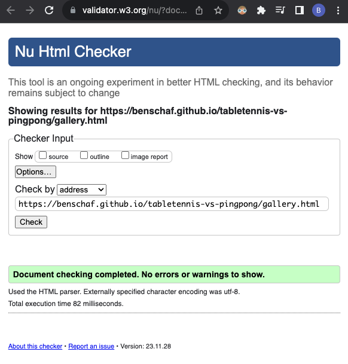
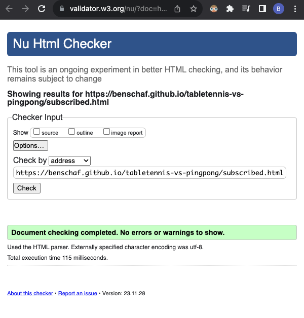
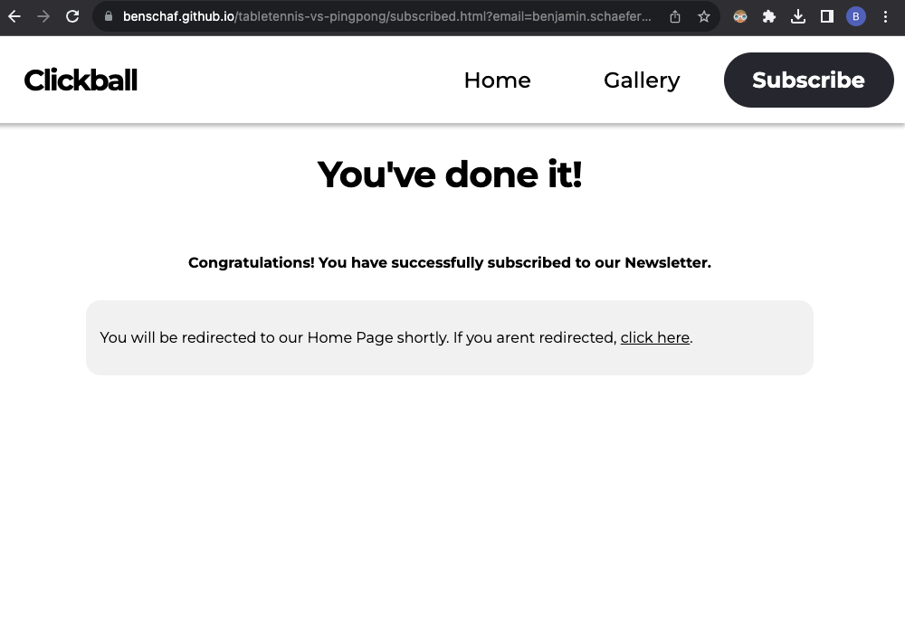
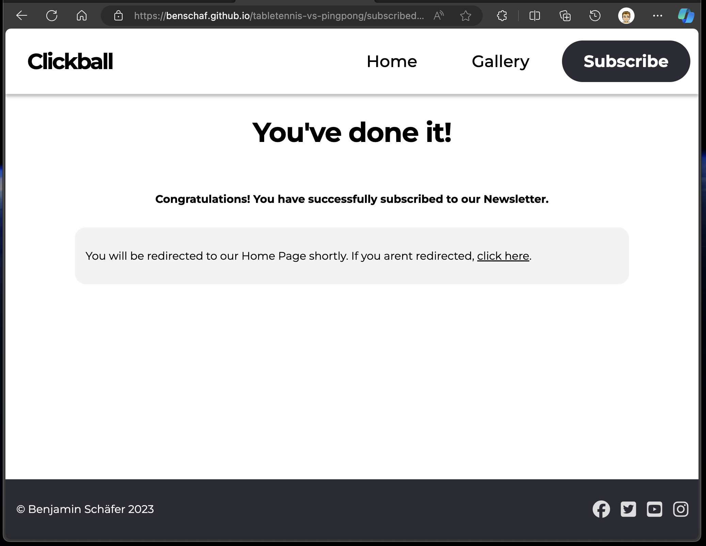
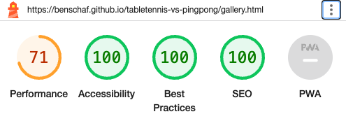

# Testing

Return back to the [README.md](README.md) file.

## Code Validation

### HTML

I have used the recommended [HTML W3C Validator](https://validator.w3.org) to validate all of my HTML files.

| Page | W3C URL | Screenshot | Notes |
| --- | --- | --- | --- |
| Landing Page | [W3C](https://validator.w3.org/nu/?doc=https%3A%2F%2Fbenschaf.github.io%2Ftabletennis-vs-pingpong%2Findex.html) |  | Pass: No Errors |
| Gallery Page | [W3C](https://validator.w3.org/nu/?doc=https%3A%2F%2Fbenschaf.github.io%2Ftabletennis-vs-pingpong%2Fgallery.html) |  | Pass: No Errors |
| Subscribed Page | [W3C](https://validator.w3.org/nu/?doc=https%3A%2F%2Fbenschaf.github.io%2Ftabletennis-vs-pingpong%2Fsubscribed.html) |  | Pass: No Errors |

### CSS

I have used the recommended [CSS Jigsaw Validator](https://jigsaw.w3.org/css-validator) to validate all of my CSS files.

| File | Jigsaw URL | Screenshot | Notes |
| --- | --- | --- | --- |
| style.css | [Jigsaw](https://jigsaw.w3.org/css-validator/validator?uri=https%3A%2F%2Fbenschaf.github.io%2Ftabletennis-vs-pingpong) |  | Pass: No Errors |

## Browser Compatibility

I've tested my deployed project on multiple browsers to check for compatibility issues.

| Browser | Home | Gallery | Contact | Notes |
| --- | --- | --- | --- | --- |
| Chrome |  |  |  | Works as expected |
| Firefox Developer Edition |  |  |  | Works as expected |
| Edge |  |  |  | Works as expected |
| Safari |  |  |  | Works as expected |

## Responsiveness

I've tested my deployed project on multiple devices to check for responsiveness issues.

| Device | Home | Gallery | Subscribed | Notes |
| --- | --- | --- | --- | --- |
| Mobile (DevTools: iPhone 12 Pro) |  |  |  | Works as expected |
| Tablet (DevTools: iPad Air) |  |  |  |  Works as expected |
| Desktop (DevTools: 1920 x 1080) |  |  |  | Works as expected |
| 4K Monitor (DevTools: 3840 x 2160) |  |  |  | Small issue where Navigation Bar and Footer are very spread apart |
| Google Pixel 6 |  |  |  | Works as expected |

## Lighthouse Audit

I've tested my deployed project using the Lighthouse Audit tool to check for any major issues.

| Page | Mobile | Desktop | Notes |
| --- | --- | --- | --- |
| Home |  |  | Slow response time due to large hero image  |
| Gallery |  |  | Slow response time due to large images |
| Subscribed |  |  | warning because of automatic redirect. |

## User Story Testing

|As a|I would like to|so that I can|Screenshot of relevant feature(s)|
|-|-|-|-|
|new site user|find information about Table Tennis,|tell my friends about it.| 
|Returning user|Access the latest news and trends in the world of Table Tennis,|Stay informed about the sport.||
|Ping Pong player|Learn more about the differences between Ping Pong and Table Tennis,|Improve my knowledge of the sport.|
|Table Tennis player|Access a media gallery with photos and videos of Table Tennis matches,|Enjoy watching Table Tennis matches and highlights.| |

## Bugs

Throughout development I switched the issue tracking from Notion to Github Issues. The Bugs section is therefore split up into two tables: one for Github Issues and one for Notion issue tracking.
All recently closed/fixed bugs can be tracked [via github Issues](https://github.com/benschaf/tabletennis-vs-pingpong/issues?q=is%3Aissue+is%3Aclosed).

### Github Issues

[Link to this repositories bugs](https://github.com/benschaf/tabletennis-vs-pingpong/issues?q=is%3Aissue+is%3Aclosed+label%3Abug)

More Information about the solution history can be found by clicking on the bug ID below.

| **ID** | **Bug** | **Status** |
| --- | --- | --- |
| [30](https://github.com/benschaf/tabletennis-vs-pingpong/issues/30) | Fix horizontal scroll | Closed |
| [18](https://github.com/benschaf/tabletennis-vs-pingpong/issues/18) | Spacing in navigation Bar is off | Closed |
| [17](https://github.com/benschaf/tabletennis-vs-pingpong/issues/17) | Email input too short on small screens | Closed |
| [16](https://github.com/benschaf/tabletennis-vs-pingpong/issues/16) | Lighthouse Validation fix accessibility | Closed |
| [15](https://github.com/benschaf/tabletennis-vs-pingpong/issues/15) | Update Theme Color meta tag on all pages | Closed |

### Notion Issue tracking
Commits that are relevant to the bug are linked in the Commit hash(es) column.
| ID | Bug | Solution | Commit hash(es) | Status |
|-|-|-|-|-|
|25|Hero section is too tall on laptop screens|adjust hero image picture height to allow for the next picture to be a scroll hint| [623f391](/../../commit/623f3910ba16ebd2d04c164753fd70557f394558) and [a80a0ad](/../../commit/a80a0ad2bf6077d61da9c1f84a061a597b065db0) | Closed |
|27|Pictures and text can be seen behind header bar|Add white background to header bar|[f138c71](/../../commit/f138c719a15af91506896fbf512943c5cf065b3d)|Closed|
|31|Cant assign styles to multiple timeline events|change timeline html attributes to classes to allow for multiple timeline bubbles to be created|[2a42ec9](/../../commit/2a42ec91d9174c4ce732545e997d130a5c13f34a)|Closed|
|37|Styles don't apply on deployed version|change address of stylesheet from static to relative|[5a7f584](/../../commit/5a7f584b7caeb6b8ed27e5aaae0cdf1b958707ed)|Closed|
|42|Styles don't apply on deployed version|change address of stylesheet from static to relative|[5a7f584](/../../commit/5a7f584b7caeb6b8ed27e5aaae0cdf1b958707ed)|Closed|
| 44 | Line in timeline section adapts due to flexbox grow/shrink properties | Add value `0` to `flex-grow` and `flex-shrink` to timeline div to prevent resizing| [0d118e8](/../../commit/0d118e87ad8aa93cce293dc29aff55a0f321f706) | Closed |
| 50 | Making quotes section titles white resulted in all h3 titles getting white | Specify separate styles for h3 titles in quotes section| [8c7e69b](/../../commit/8c7e69b966fecc2169487e53a9881acf8a19cfae) | Closed |
| 51 | Qutoes section title spells Qutotes instead of quotes | fix quotes title typo | [5b015bf](/../../commit/5b015bf52b0f0183e608aefc05702604a137e45e) | Closed |
| 56 | Hero section has x-axis overflow on small screens | make hero font smaller to fit on small phones | [8956475](/../../commit/8956475965cf7dd3bbf2d706483829b136074b82) | Closed |
| 59 | Button tags shouldn't be used just because a link looks like a button | remove unnecessary button tag | [bcaa95f](/../../commit/bcaa95fe48100ec2ac230e5117514ebd864d8627) | Closed |
| 65 | Footer isn't at the bottom when main section has little content | Add `flex-grow: 1;` to `main` style to enlarge main section if it has too little content |[7bb5fef](/../../commit/7bb5fef0e7b9b81b863849f29370ce9136f0542c)| Closed |
| 72 | Fontawesome Arrow in Timeline Section is displayed over the Navigation bar | Add `z-index: 9999;` to `header` | [0a0caa7](/../../commit/0a0caa703678f458155e6879dd613929b3cc4de5) and [84a3fc9](/../../commit/84a3fc9237c078838170e94269b4f5a6d2340267) and [96f0e6b](/../../commit/96f0e6ba0472c71924d1231bb3491290fd5bca22) and [81355af](/../../commit/81355afe456ea6403d48b923808bdc16325ae689) |Closed |
| 75 | email input field is not wide enough for long emails | increase width of email input field | [491b315](/../../commit/491b315fc3d033dcd5a9d42f9325235cd7837190) and [aaab3ff](/../../commit/aaab3fffaef44c136a0bfc665a1a8c715fed0f05) | Closed |
| 79 | Title letter spacing doesn't apply | fix: change wrong property to letter-spacing| [afdfcf7](/../../commit/afdfcf72b93a05da0ec7cb9bf600fac26ded5a42) | Closed |
|81| Card in subscribed.html has x-axis overflow | restrict width of card on wide screens | [733e978](/../../commit/733e9781394309a3465e7c53ed65e821e3e125b5)|Closed|

## Unfixed Bugs

- When validating subscribed.html with lighthouse validation the accessibility score isn't 100% (see Lighthouse Audit). This is becasue of the automatic redirect link. 
    - The recommended fix for this is to make the user aware of the redicrect using (for example) a visual timer that runs out and a possibility to interrupt the automatic redirect. These features require javascript which is not in the scope of this project. The current solution is acceptable and not a major hinderance to accessibility since the user is warned via text.
- [Github issue #19](https://github.com/benschaf/tabletennis-vs-pingpong/issues/19) Subscribe button from gallery to subscribe Section doesn't scroll down.
    - Can't fix because I'm not able to reproduce the bug.
