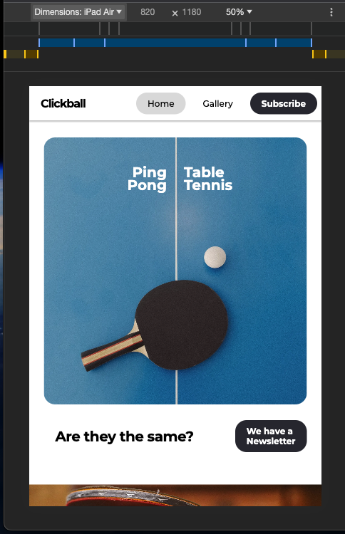
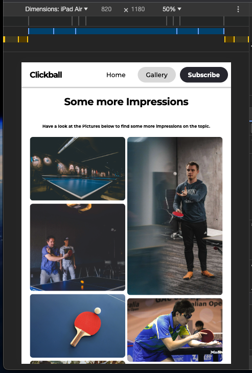
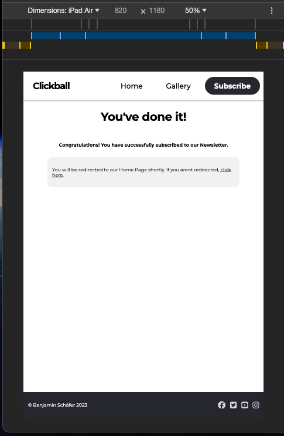
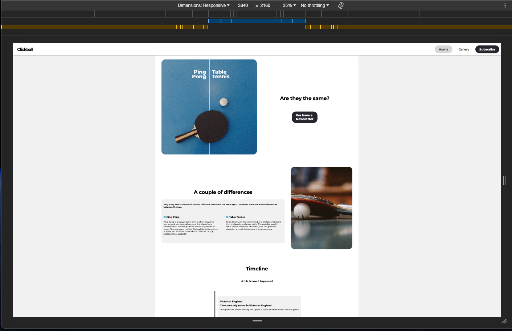
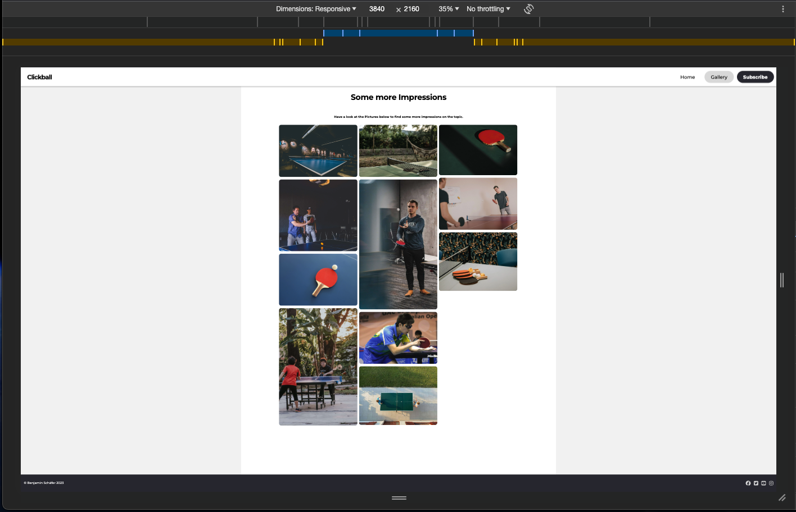
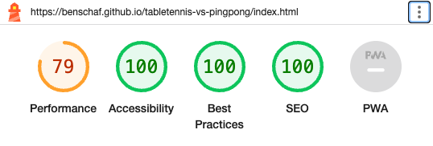
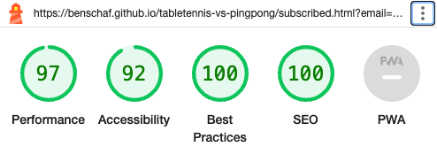

# Testing

Return back to the [README.md](README.md) file.

## Code Validation

### HTML

I have used the recommended [HTML W3C Validator](https://validator.w3.org) to validate all of my HTML files.

| Page | W3C URL | Screenshot | Notes |
| --- | --- | --- | --- |
| Landing Page | [W3C](https://validator.w3.org/nu/?doc=https%3A%2F%2Fbenschaf.github.io%2Ftabletennis-vs-pingpong%2Findex.html) |  | Pass: No Errors |
| Gallery Page | [W3C](https://validator.w3.org/nu/?doc=https%3A%2F%2Fbenschaf.github.io%2Ftabletennis-vs-pingpong%2Fgallery.html) |  | Pass: No Errors |
| Subscribed Page | [W3C](https://validator.w3.org/nu/?doc=https%3A%2F%2Fbenschaf.github.io%2Ftabletennis-vs-pingpong%2Fsubscribed.html) |  | Pass: No Errors |

### CSS

I have used the recommended [CSS Jigsaw Validator](https://jigsaw.w3.org/css-validator) to validate all of my CSS files.

| File | Jigsaw URL | Screenshot | Notes |
| --- | --- | --- | --- |
| style.css | [Jigsaw](https://jigsaw.w3.org/css-validator/validator?uri=https%3A%2F%2Fbenschaf.github.io%2Ftabletennis-vs-pingpong) |  | Pass: No Errors |

## Browser Compatibility

I've tested my deployed project on multiple browsers to check for compatibility issues.

| Browser | Home | Gallery | Contact | Notes |
| --- | --- | --- | --- | --- |
| Chrome |  |  |  | Works as expected |
| Firefox Developer Edition |  |  |  | Works as expected |
| Edge |  |  |  | Works as expected |
| Safari |  |  |  | Works as expected |

## Responsiveness

I've tested my deployed project on multiple devices to check for responsiveness issues.

| Device | Home | Gallery | Subscribed | Notes |
| --- | --- | --- | --- | --- |
| Mobile (DevTools: iPhone 12 Pro) |  |  |  | Works as expected |
| Tablet (DevTools: iPad Air) |  |  |  |  Works as expected |
| Desktop (DevTools: 1920 x 1080) |  |  |  | Works as expected |
| 4K Monitor (DevTools: 3840 x 2160) |  |  |  | Small issue where Navigation Bar and Footer are very spread apart |
| Google Pixel 6 |  |  |  | Works as expected |

## Lighthouse Audit

I've tested my deployed project using the Lighthouse Audit tool to check for any major issues.

| Page | Mobile | Desktop | Notes |
| --- | --- | --- | --- |
| Home |  |  | Slow response time due to large hero image  |
| Gallery |  |  | Slow response time due to large images |
| Subscribed |  |  | warning because of automatic redirect. |

## User Story Testing

🛑🛑🛑🛑🛑 START OF NOTES (to be deleted) 🛑🛑🛑🛑🛑

Testing user stories is actually quite simple, once you've already got the stories defined on your README.

Most of your project's **features** should already align with the **user stories**,
so this should as simple as creating a table with the user story, matching with the re-used screenshot
from the respective feature.

🛑🛑🛑🛑🛑 END OF NOTES (to be deleted) 🛑🛑🛑🛑🛑

| User Story | Screenshot |
| --- | --- |
| As a new site user, I would like to ____________, so that I can ____________. |  |
| As a new site user, I would like to ____________, so that I can ____________. |  |
| As a new site user, I would like to ____________, so that I can ____________. |  |
| As a returning site user, I would like to ____________, so that I can ____________. |  |
| As a returning site user, I would like to ____________, so that I can ____________. |  |
| As a returning site user, I would like to ____________, so that I can ____________. |  |
| As a site administrator, I should be able to ____________, so that I can ____________. |  |
| As a site administrator, I should be able to ____________, so that I can ____________. |  |
| As a site administrator, I should be able to ____________, so that I can ____________. |  |
| repeat for all remaining user stories | x |

## Bugs

Throughout development I switched the issue tracking from Notion to Github Issues. The Issue tracking system used for each bug is also noted in the table below.
All recently closed/fixed bugs can be tracked [via github Issues](https://github.com/benschaf/tabletennis-vs-pingpong/issues?q=is%3Aissue+is%3Aclosed).

Certainly! Here's the updated table with the GitHub issue links as the first column:

| **ID / Github Issue** | **Bug** | **Status** |
| --- | --- | --- |
| [30](https://github.com/benschaf/tabletennis-vs-pingpong/issues/30) | Fix horizontal scroll bug | Closed yesterday |
| [18](https://github.com/benschaf/tabletennis-vs-pingpong/issues/18) | Spacing in navigation Bar is off bug | Closed |
| [17](https://github.com/benschaf/tabletennis-vs-pingpong/issues/17) | Email input too short on small screens bug | Closed |
| [16](https://github.com/benschaf/tabletennis-vs-pingpong/issues/16) | Lighthouse Validation fix accessibility bug | Closed |
| [15](https://github.com/benschaf/tabletennis-vs-pingpong/issues/15) | Update Theme Color meta tag on all pages bug | Closed |

## Unfixed Bugs

🛑🛑🛑🛑🛑 START OF NOTES (to be deleted) 🛑🛑🛑🛑🛑

You will need to mention unfixed bugs and why they were not fixed.
This section should include shortcomings of the frameworks or technologies used.
Although time can be a big variable to consider, paucity of time and difficulty understanding
implementation is not a valid reason to leave bugs unfixed.

If you've identified any unfixed bugs, no matter how small, be sure to list them here.
It's better to be honest and list them, because if it's not documented and an assessor finds the issue,
they need to know whether or not you're aware of them as well, and why you've not corrected/fixed them.

Some examples:

🛑🛑🛑🛑🛑 END OF NOTES (to be deleted) 🛑🛑🛑🛑🛑

- On devices smaller than 375px, the page starts to have `overflow-x` scrolling.

    

    - Attempted fix: I tried to add additional media queries to handle this, but things started becoming too small to read.

- For PP3, when using a helper `clear()` function, any text above the height of the terminal does not clear, and remains when you scroll up.

    

    - Attempted fix: I tried to adjust the terminal size, but it only resizes the actual terminal, not the allowable area for text.

- When validating HTML with a semantic `section` element, the validator warns about lacking a header `h2-h6`. This is acceptable.

    

    - Attempted fix: this is a known warning and acceptable, and my section doesn't require a header since it's dynamically added via JS.

🛑🛑🛑🛑🛑 START OF NOTES (to be deleted) 🛑🛑🛑🛑🛑

If you legitimately cannot find any unfixed bugs or warnings, then use the following sentence:

🛑🛑🛑🛑🛑 END OF NOTES (to be deleted) 🛑🛑🛑🛑🛑

There are no remaining bugs that I am aware of.
